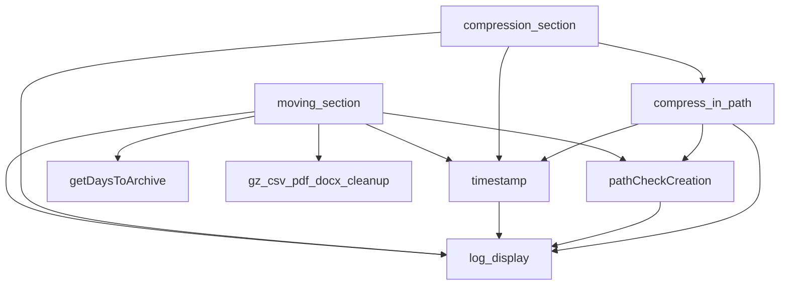

---
tags:
  - Bash
---

## Purpose: Data Archiving for Disk Space Optimization

This script helps free up disk space by archiving incident, entry, and indicator data from the `/var/lib/demisto/tenants/{TENANT_NAME}/data` and `/var/lib/demisto/data` folders and moving them to the `/backups/demisto-archive` directory.

## Build
The build process is managed through Gitlab's continuous integration (CI) using the `.gitlab-ci.yml` file. The build stage utilizes a script called [rpm-build.sh](https://git.mss.capgemini.com/cicd/rpm/-/blob/master/rpm-build.sh) and the deployment stage uses [repo-deploy.sh](https://git.mss.capgemini.com/cicd/repo/-/blob/master/repo-deploy.sh) to store the resulting `.rpm` packages in a repository.

## Installation 

Using Ansible role

Manual: `yum --enablerepo=mss install xsoar-archive -y`
<!--
sudo yum localinstall <rpm_file>
rpm -ivh xsoar-archive-1.0-1.el7.noarch.rpm
-->

## Running the script

To run the script, you need to pass one of the two options:

-   `-s` : This option runs the whole script which includes stopping Demisto service, archiving and compressing tenant files, moving the files to the backups directory, and starting Demisto service.
-   `-a` : This option runs only the archiving and compressing tenant files, moving the files to the backups directory.

For example, to run the script with the `-s` option, you would enter `sh /bin/scriptname.sh -s` in the command line.

### The script contains several functions that are used to perform specific tasks:

Each function is meant to be called as part of a larger script that coordinates the archiving process and provides an overall summary of the time taken for each task and any errors that might have occurred.

#### log_display
This function is used to display messages in the console and log them to a file. It serves as a way to log information, errors or success in a consistent way providing clear and organized information about the script's execution.

The messages printed to the console with different colors, makes it easy to spot errors or important information.

The log file that this function is appending to is also a useful feature as it allows the user to review the script's output even after it has finished running, this could be helpful in cases where the script has been running for long periods of time or when the user want to check the script's output at a later time.

#### gz_csv_pdf_docx_cleanup
The `gz_csv_pdf_docx_cleanup` function is a utility function that is used to delete certain types of files that are older than a certain age from a specific directory.  

The criteria that the function checks for is :  
- `.gz` and `.csv` files
- `.pdf` and `.docx` files older than 7 days

#### timestamp
This function is a utility function that is used to calculate and display the amount of time tak en for a certain process. The function takes four arguments:  

- `STARTTIME`: the start time of the process
- `ENDTIME`: the end time of the process
- `message`: a string that describes the process that was timed
- `switch`: an optional argument that is used to switch off recording the duration to `timesRecord` variable

#### pathCheckCreation
This function serves as a way to check if a directory exists and to create it if it does not. It is a helper function that can be used within the script to ensure that a specific directory is present before proceeding with other operations, like creating files or folders within that path, it also provides clear and organized information about the script's execution, by logging the creation of the path if it's needed

#### getDaysToArchive
This function is a utility function that finds and returns a list of months in the format "mmYYYY" for files older than a specified number of days in a given directory. It serves as a way to find files that need to be archived based on their age and it will be used by the script to decide which folders need to be archived

#### compress_in_path
This function is a utility function that compresses all folders in a given directory, and moves them to their corresponding "archived-YYYY" folder, while logging success or failure of each step in the process and it also outputs the time taken for each iteration of the for loop.

#### moving_section
This function is responsible for moving the content from the `/data` folder of demisto and each tenant to the `/demisto-archive` folder. It moves the content that is older than a specified number of days. The number of days is passed as an argument to the script and if none is provided, a default value of 365 days is used.

#### compression_section
This function performs compression and archiving operations on files and folders, specifically within the Demisto and Tenant file system. The script accepts a list of Tenant names as arguments, and uses this list to iterate through each tenant's directory, compressing and archiving the data within them. The script uses two nested for-loops to achieve this, the first looping through the list of tenants and the second looping through a list of unique days to archive.

#### move_folder
This function moves the content from a staging area to the `/backups` directory. It appends the current hostname to the destination folder name.

<!-- … 
Reference Documentation: [free-up-disc-space-with-data-archiving](https://docs.paloaltonetworks.com/cortex/cortex-xsoar/6-1/cortex-xsoar-admin/manage-data/free-up-disc-space-with-data-archiving) |
[new link](https://docs-cortex.paloaltonetworks.com/r/Cortex-XSOAR/6.10/Cortex-XSOAR-Administrator-Guide/Free-up-Disk-Space-with-Data-Archiving)
-->
\
