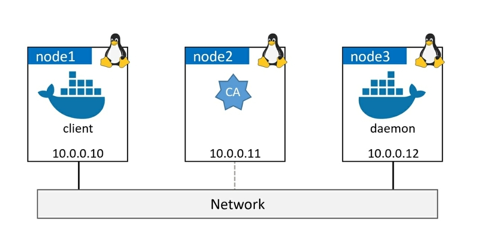

> [!NOTE]
> The project involves configuring Docker for secure communication between the client and the daemon in both client mode and daemon mode TLS. The aim is to establish a secure environment for production use, even when all traffic is confined within trusted internal networks.
> 
> To achieve this, the client and the daemon will be secured using certificates signed by a trusted Certificate Authority (CA). The client will be configured to only connect to Docker daemons that present certificates signed by the trusted CA, while the daemon will only accept connections from clients that provide certificates from the same trusted CA.
> 
> 
> 


*The CA we're building here is to help demonstrate how to configure Docker, we're not attempting to build something production-grade.*

I'll be using Vagrant to create the test environment

<details>
<summary>Vagrantfile</summary>

```css
Vagrant.configure("2") do |config|
  
    config.vm.box = "ubuntu/bionic64" # Choose your desired base box
    
    # Shared folder configuration
    config.vm.synced_folder "./shared", "/home/vagrant/shared"

    # Create node1
    config.vm.define "node1" do |node1|
      node1.vm.hostname = "node1"
      node1.vm.network "private_network", ip: "10.0.0.10"
      # Provisioning script for Docker client and host entries
      node1.vm.provision "shell", inline: <<-SHELL
        # Install Docker client
        apt-get update
        apt-get install -y docker.io
        
        # Add entries in hosts file for name resolution
        echo "10.0.0.10 node1" >> /etc/hosts
        echo "10.0.0.11 node2" >> /etc/hosts
        echo "10.0.0.12 node3" >> /etc/hosts
        sed -i '/127\.0\.2\.1/d' /etc/hosts
      SHELL
    end
    
    # Create node2
    config.vm.define "node2" do |node2|
      node2.vm.hostname = "node2"
      node2.vm.network "private_network", ip: "10.0.0.11"
      # Provisioning script for CA and host entries
      node2.vm.provision "shell", inline: <<-SHELL
        # Install CA services or perform other configuration as needed
        #n/a
        # Add entries in hosts file for name resolution
        echo "10.0.0.10 node1" >> /etc/hosts
        echo "10.0.0.11 node2" >> /etc/hosts
        echo "10.0.0.12 node3" >> /etc/hosts
        sed -i '/127\.0\.2\.1/d' /etc/hosts
      SHELL
    end
    
    # Create node3
    config.vm.define "node3" do |node3|
      node3.vm.hostname = "node3"
      node3.vm.network "private_network", ip: "10.0.0.12"
      # Provisioning script for Docker daemon and host entries
      node3.vm.provision "shell", inline: <<-SHELL
        # Install Docker daemon or perform other configuration as needed
        apt-get update
        apt-get install -y docker.io
        # Add entries in hosts file for name resolution
        echo "10.0.0.10 node1" >> /etc/hosts
        echo "10.0.0.11 node2" >> /etc/hosts
        echo "10.0.0.12 node3" >> /etc/hosts
        sed -i '/127\.0\.2\.1/d' /etc/hosts
      SHELL
    end

  end
```

</details>

*All nodes have access to a shared folder called `shared` that I'll use to distribute the keys*  


### Creating the envrioment

We execute the `Vagrantfile` 
```bash
vagrant up
```
Just checking everything is up

```bash
PS C:\Users\Hecti\Downloads\Vagrant> vagrant status
Current machine states:

node1                     running (virtualbox)
node2                     running (virtualbox)
node3                     running (virtualbox)

This environment represents multiple VMs. The VMs are all listed
above with their current state. For more information about a specific
VM, run `vagrant status NAME`.
```

Using `vagrant ssh <node>` I'll login to each node and I'll test the manual DNS (Domain Name System) mapping on the local system is working by pinging the other nodes.  
*If DNS is not working the configurations we'll do won't work*

**Example:**
```bash
vagrant@node1:~$ ping node2
PING node2 (10.0.0.11) 56(84) bytes of data.
64 bytes from node2 (10.0.0.11): icmp_seq=1 ttl=64 time=0.575 ms
64 bytes from node2 (10.0.0.11): icmp_seq=2 ttl=64 time=0.940 ms
```


## Create a CA (self-signed certs)

### Create private key for the CA
*We run all commands from the CA (node 2)*
```bash
openssl genrsa -aes256 -out ca-key.pem 4096
```
*Requires you to set a pass phrase*
*Generates a file `ca-key.pem`*

### Generate a self-signed certificate using the private key  
*The certificate itself contains the public key as part of its structure and the corresponding private key (`ca-key.pem`) is used during the certificate generation process.*

```bash
openssl req -new -x509 -days 730 -key ca-key.pem -sha256 -out ca.pem
```
It will ask to input some information
```bash
Enter pass phrase for ca-key.pem:
You are about to be asked to enter information that will be incorporated
into your certificate request.
What you are about to enter is what is called a Distinguished Name or a DN.
There are quite a few fields but you can leave some blank
For some fields there will be a default value,
If you enter '.', the field will be left blank.
-----
Country Name (2 letter code) [AU]:US
State or Province Name (full name) [Some-State]:FL
Locality Name (eg, city) []:Miami
Organization Name (eg, company) [Internet Widgits Pty Ltd]:ABC
Organizational Unit Name (eg, section) []:IT
Common Name (e.g. server FQDN or YOUR name) []:Node2
Email Address []:hector@email.com
```
*Generates a file `ca.pem`*  

These two files `ca-key.pem` and `ca.pem` are the CA's key-pair and form the identity of the CA.  The CA is ready to use.   

## Create a key-pair for the daemon
*We run all commands from the CA (node 2)*
```bash
openssl genrsa -out daemon-key.pem 4096
```
*Generates a file `daemon-key.pem`*

### Create a Certificate Signing Request (CSR) for the CA to create and sign a certificate for the daemon
```bash
openssl req -subj "/CN=node3 -sha256" -new -key daemon-key.pem -out daemon.csr
```
*Generates a file `daemon.csr`*

### Add required attributes to the certificate
This step creates a file `extfile.cnf` that tells the CA to add a couple of extended 
attributes to the daemon's certificate when it signs it. These add the 
daemon's DNS name and IP address, as well as configure the certificate 
to be valid for server authentication. 

Our `extfile.cnf` contains
```bash
vagrant@node2:~$ cat extfile.cnf 
subjectAltName = DNS:node3, IP:10.0.0.12
extendedKeyUsage = serverAuth
vagrant@node2:~$ 
```

### Generate the certificate (for daemon/node3)

This step uses the CSR file `daemon.csr`, CA keys `ca-key.pem`, CA Certificate `ca.pem` and the `extfile.cnf` file to sign 
and configure the daemon's certificate. 

```bash
openssl x509 -req -days 730 -sha256 -in daemon.csr -CA ca.pem -CAkey ca-key.pem -CAcreateserial -out daemon-cert.pem -extfile extfile.cnf
```
*It will output the daemon's signed certificate (public key) as a new file called `daemon-cert.pem`*

At this point, you have a working **CA**, as well as a **key-pair** for **node3** that can be used to secure the Docker daemon.  

We delete the CSR `daemon.csr` and `extfile.cnf` used to sign the daemon certificate
```bash
rm daemon.csr extfile.cnf
```

## Create a key-pair for the client  
*We run all commands from the CA (node 2)*  
Will repeat what we just did in for node3, but this time we do it for the node1 which will run the Docker client  


###  Create a private key for node1
```bash
openssl genrsa -out client-key.pem 4096
```
*Generates a file `client-key.pem`*

### Create a CSR
We make sure to use the correct DNS name of the node that will be your secure Docker client. We are using node1  
```bash
openssl req -subj "/CN=node1" -new -key client-key.pem -out client.csr
``` 
*Generates a file `client.csr`*  

### Create extfile.conf
Make sure it has the following content
```bash
vagrant@node2:~$ cat extfile.cnf 
extendedKeyUsage = clientAuth
vagrant@node2:~$ 
```
This will make the certificate valid for client authentication. 

### Generate the certificate (for client/node1)
Using the CSR `client.csr`, the CA's certificate `ca.pem` *(public key)* and private keys `ca-key.pem`, and the `extfile.cnf` file.  
```bash
openssl x509 -req -days 730 -sha256 -in client.csr -CA ca.pem -CA ca.pem -CAkey ca-key.pem -CAcreateserial -out client-cert.pem -extfile extfile.cnf
```
*Generates a file `client-cert.pem`*  


Delete the CSR and `extfile.cnf` files  
```bash
rm client.csr extfile.cnf 
```

At this point you should have the following 7 files in your working 
```css
ca-key.pem       << CA private key
ca.pem           << CA public key (certificate)
ca.srl           << Tracks serial numbers
client-cert.pem  << Client public key (certificate)
client-key.pem   << Client private key)
daemon-cert.pem  << Daemon public key (certificate)
daemon-key.pem   << Daemon private key)
```

Before moving on,we you should remove write permission from the private keys and make them only readable to us and other accounts that are members of our group.  
```bash
chmod 0400 ca-key. pem client-key. pem daemon-key. pem
```
You should also remove write access to the public key certificates. 
```bash
chmod -v 0444 ca . pem daemon-cert. pem client-cert. pem 
```

## Distribute keys
The presence of the CA's public key (`ca.pem`) on the client and daemon  nodes is what tells them to trust the certificates signed by the CA.

### In node2
We'll copy all the generated file to a share folder for all other nodes to access
```bash
cp ca-key.pem ca.pem ca.srl client-cert.pem client-key.pem daemon-cert.pem daemon-key.pem shared/
```
### In node1
We create a `~/.docker` folder, set its permissions, and copy the required files (`client-cert.pem`, `client-key.pem`, and `ca.pem`) from the `/shared` folder to the `~/.docker` folder. The files are renamed during the copying process.  

```bash
mkdir .docker
chmod 777 .docker
cp shared/client-cert.pem .docker/cert.pem      
cp shared/client-key.pem .docker/key.pem        
cp shared/ca.pem .docker/
```

### In node3
The provided commands create a `~/.docker` folder, set its permissions, and copy the required files (`daemon-cert.pem`, `daemon-key.pem`, and `ca.pem`) from the /shared folder to the `~/.docker `folder. The files are placed in the appropriate locations with the desired names.

```bash
mkdir .docker
chmod 777 .docker
cp shared/daemon-cert.pem ~/.docker/cert.pem
cp shared/daemon-key.pem  ~/.docker/key.pem
cp shared/ca.pem .docker/
```

## Configure Docker for TLS
Daemon mode forces the daemon only to allow connections from clients with a valid certificate. Client mode tells the client only to connect with daemons that have a valid certificate. 


### Configuring the Docker daemon for TLS (node3)
As simple as setting few daemon flags in the `daemon.json` configuration file in `/etc/docker/` *(might need to create)*

```bash
{
  "tls": true,
  "tlsverify": true,
  "tlscacert": "/home/vagrant/.docker/ca.pem",
  "tlscert": "/home/vagrant/.docker/cert.pem",
  "tlskey": "/home/vagrant/.docker/key.pem"
}
```
- `tlsverify`: Enables or disables TLS verification for secure communication. `true` means TLS verification is enabled.
- `tlscacert`: Specifies the path to the trusted Certificate Authority (CA) certificate. Docker will trust certificates signed by this CA.
- `tlscert`: Specifies the path to the daemon's certificate.
- `tlskey`: Specifies the path to the daemon's private key.
- `hosts`: Specifies the sockets that the Docker daemon should listen on. This is an array and can have multiple entries. The example shows Docker listening on the default Unix socket and also on TCP port 2376 on all network interfaces.

Did not include `"hosts": ["tcp://node3:2376"],` because:
> Warning! Linux systems running systemd don't allow you to use the 
"hosts" option in daemon.json. Instead, you have to specify it in 
a systemd override file. You may be able to do this with the sudo 
systemctl edit docker command. This will open anew file called / 
etc/systemd/system/docker.service.d/override.conf in an 
editor. Add the following three lines and save the file. 

It will cause the following error when restarting docker:
> Failed to restart docker.service: Unit docker.service is not loaded properly: Invalid argument.
See system logs and 'systemctl status docker.service' for details.  

The solution is to specify it in the `override.cnf`

By using the `systemctl edit` command, we create an override file specifically for the Docker service. In the override file, you can define different values for the same parameter(s) or add additional parameters to customize the behavior of the Docker service.

*The purpose of the override configuration is to modify specific settings or parameters of the Docker service without directly modifying the main service unit file (`docker.service`).*

The path might not exist so we create it
```bash
sudo mkdir -p /etc/systemd/system/docker.service.d/
```

```bash
sudo sh -c 'cat << EOF >> /etc/systemd/system/docker.service.d/override.conf
{
  [Service]
  ExecStart=
  ExecStart=/usr/bin/dockerd -H tcp://node3:2376
}
EOF'
```
Making sure the changes take effect
```bash
sudo systemctl daemon-reload
sudo systemctl restart docker
```

Once docker is restarted, we check that the new hosts value is in effect by inspecting the output of a `ps` command
```bash
vagrant@node3:~/.docker$ ps -elf | grep dockerd
4 S root       13772       1  0  80   0 - 324763 -     02:35 ?        00:00:00 /usr/bin/dockerd -H tcp://node3:2376
0 R vagrant    13948   12474  0  80   0 -  2040 -      02:36 pts/0    00:00:00 grep --color=auto dockerd
vagrant@node3:~/.docker$ 
```

The presence of `-H tcp://node3:2376` in the command output is evidence the daemon is listening on the network. Port 2376 is the standard port for Docker using TLS. 2375 is the default unsecured port. At this point, running a command such as docker version from **node1** won't work. This is because the **daemon** is configured to listen on the network, but the **Docker client** is still trying use the local IPC socket. Try the command again, but this time adding the `-H tcp://node3:2376` flag.

```bash
vagrant@node1:~$ docker -H tcp://node3:2376 version
Client:
 Version:           20.10.21
 API version:       1.41
 Go version:        go1.18.1
 Git commit:        20.10.21-0ubuntu1~18.04.3
 Built:             Thu Apr 27 05:50:21 2023
 OS/Arch:           linux/amd64
 Context:           default
 Experimental:      true
Error response from daemon: Client sent an HTTP request to an HTTPS server.
vagrant@node1:~$
```
*Shows how unsecured docker client was rejected by secured daemon.*

### Configuring the Docker client for TLS (node1)

In this section, we'll configure the Docker client on **node1** for two things: 
- To connect to a remote daemon over the network   
- To sign all docker commands

Export **DOCKER_TLS_VERIFY** environment variable to tell the Docker client to sign all   commands with its certificate.   
```bash
export DOCKER_TLS_VERIFY=1
```

<!-- NOT WOKRING
For a permanent change create a `daemon.json` like in **node3** this time with the following content
Maybe issue is that daemon.json is for daemon and client has its own file
```bash
{
  "tlsverify": true
}
```
-->

After enabling TLS verification in the Docker client by setting the DOCKER_TLS_VERIFY environment variable to 1, you can test the connection using the docker command with the appropriate host and port.

```bash
vagrant@node1:~$ export DOCKER_TLS_VERIFY=1
vagrant@node1:~$ docker -H tcp://node3:2376 version
Client:
 Version:           20.10.21
 API version:       1.41
 Go version:        go1.18.1
 Git commit:        20.10.21-0ubuntu1~18.04.3
 Built:             Thu Apr 27 05:50:21 2023
 OS/Arch:           linux/amd64
 Context:           default
 Experimental:      true

Server:
 Engine:
  Version:          20.10.21
  API version:      1.41 (minimum version 1.12)
  Go version:       go1.18.1
  Git commit:       20.10.21-0ubuntu1~18.04.3
  Built:            Thu Apr 27 05:36:22 2023
  OS/Arch:          linux/amd64
  Experimental:     false
 containerd:
  Version:          1.6.12-0ubuntu1~18.04.1
  GitCommit:
 runc:
  Version:          1.1.4-0ubuntu1~18.04.2
  GitCommit:
 docker-init:
  Version:          0.19.0
  GitCommit:
vagrant@node1:~$
```

The Docker client successfully established a secure connection with the Docker daemon, ensuring a secure and encrypted communication channel between the two. 