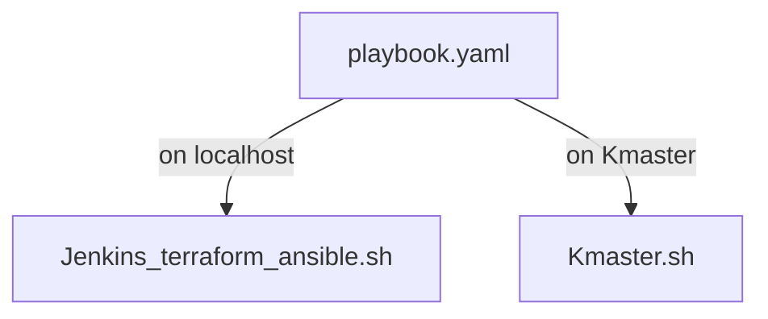

%%==2023-12-17==%%

> [!info]- Project : Capstone II
> You are hired as a DevOps Engineer for Analytics Pvt Ltd. This company is a product based organization which uses Docker for their containerization needs within the company. The final product received a lot of traction in the first few weeks of launch. Now with the increasing demand, the organization needs to have a platform for automating deployment, scaling and operations of application containers across clusters of hosts. As a DevOps Engineer, you need to implement a DevOps lifecycle such that all the requirements are implemented without any change in the Docker containers in the testing environment. 
> 
> Up until now, this organization used to follow a monolithic architecture with just 2 developers. The product is present on: https://github.com/hshar/website.git 
> 
> **Following are the specifications of the lifecycle:** 
> 1. Git workflow should be implemented. Since the company follows a monolithic architecture of development, you need to take care of version control. The release should happen only on the 25th of every month. 
> 2. CodeBuild should be triggered once the commits are made in the master branch. 
> 3. The code should be containerized with the help of the Dockerfile. The Dockerfile should be built every time if there is a push to GitHub. Create a custom Docker image using a Dockerfile. 
> 4. As per the requirement in the production server, you need to use the Kubernetes cluster and the containerized code from Docker Hub should be deployed with 2 replicas. Create a NodePort service and configure the same for port 30008. 
> 5. Create a Jenkins Pipeline script to accomplish the above task. 
> 6. For configuration management of the infrastructure, you need to deploy the configuration on the servers to install necessary software and configurations. 
> 7. Using Terraform, accomplish the task of infrastructure creation in the AWS cloud provider. 
> 
> **Architectural Advice:** 
> Softwares to be installed on the respective machines using configuration management. 
> 	**Worker1:** Jenkins, Java
> 	**Worker2:** Docker, Kubernetes 
> 	**Worker3:** Java, Docker, Kubernetes 
> 	**Worker4:** Docker, Kubernetes 
> 
> <br>![[Pasted image 20231124221734.png]]
> 
> <br>![[Pasted image 20231124221811.png|397]]


%%
I installed Jenkins on the `Jenkins_Terraform_Ansible` EC2 instance using the script [[Jenkins_terraform_ansible.sh]] (==updated it== ). However, I encountered an issue with Jenkins freezing. To resolve this, I set up a new EC2 instance with Ubuntu 22 and installed the newest version of Jenkins, following the [official documentation](https://pkg.jenkins.io/debian-stable/).
Keep in mind the Java version in Jenkins Host and Agent need to be the same%%


### Terraform
**I create an EC2 instance named `Jenkins_Terraform_Ansible`**

Install Terraform:
```bash
wget -O- https://apt.releases.hashicorp.com/gpg | sudo gpg --dearmor -o /usr/share/keyrings/hashicorp-archive-keyring.gpg
echo "deb [signed-by=/usr/share/keyrings/hashicorp-archive-keyring.gpg] https://apt.releases.hashicorp.com $(lsb_release -cs) main" | sudo tee /etc/apt/sources.list.d/hashicorp.list
sudo apt update && sudo apt install terraform -y
```
<br>![[Pasted image 20231215145002.png]]

For Terraform to authenticate with AWS, I will create a file named `~/.aws/credentials` that contains my AWS access key and secret key. The AWS provider will automatically pick up the credentials from this shared credentials file.

```bash
[default]
aws_access_key_id = your_access_key
aws_secret_access_key = your_secret_key
```

---
I'll provision 3 "Ubuntu 20.04 LTS" EC2 instances with the following `main.tf`

```bash
provider "aws" {
  region = "us-east-1"                     
}

resource "aws_instance" "K8-M" {
  ami = "ami-06aa3f7caf3a30282" #Ubuntu 20.04 LTS
  instance_type = "t2.medium"
  key_name = "daro.io"
  subnet_id = "subnet-05419866677eb6366"      
  tags = {
    Name = "Kmaster"                                 
  }
}

resource "aws_instance" "K8-S1" {
  ami = "ami-06aa3f7caf3a30282"
  instance_type = "t2.micro"
  key_name = "daro.io"
  subnet_id = "subnet-05419866677eb6366"
  tags = {
    Name = "Kslave1"                                          
  }
}

resource "aws_instance" "K8-S2" {
  ami = "ami-06aa3f7caf3a30282"
  instance_type = "t2.micro"
  key_name = "daro.io"
  subnet_id = "subnet-05419866677eb6366"
  tags = {
    Name = "Kslave2"                                           
  }
}
```

I use the following commands to initiate the AWS plugin, view the plan, and apply it in Terraform:
```bash
terraform init
terraform plan
terraform apply
```
<br>![[Pasted image 20231215165557.png]]

My 3 new instances are "Kmaster", "Kslave1" and "Kslave2"
<br>![[Pasted image 20231215165658.png]]

---
### Ansible
**Install Ansible on the `Jenkins_Terraform_Ansible`**

```bash
sudo apt update
sudo apt install software-properties-common
sudo add-apt-repository --yes --update ppa:ansible/ansible
sudo apt install ansible -y
```
<br>![[Pasted image 20231215170036.png]]

**Creating an Inventory**
I create a file `inventory.ini`

%%[[Assignment 1 – Ansible_Module 5_Devops BC = 2330070508#^29ce4e|Create inventory for ansible]]%%

```yaml
[all:vars]
ansible_user=ubuntu

[kmaster]
Kmaster ansible_host=10.0.1.52

[kslave]
Kslave1 ansible_host=10.0.1.67
Kslave2 ansible_host=10.0.1.119
```

^8173dd

**SSH setup**
%%[[Assignment 1 – Ansible_Module 5_Devops BC = 2330070508#^be0450|reference: setup ssh]]%% 
To enable Ansible to connect to the nodes in my inventory, I recreated the key `daro.io.pem` on the server and ran `ssh-agent`. This allows me to connect without having to specify the key for the remainder of the session. The commands I use are:
```bash
eval $(ssh-agent -s)
sudo chmod 600 daro.io.pem
ssh-add daro.io.pem
ssh-add -l
```

**I test connection**

```bash
ansible all -m ping -i inventory.ini
```
<br>![[Pasted image 20231215174935.png]]


### Playbook and scripts



<br>![[playbook.yaml]]

---

<br>![[Kmaster.sh]]

<br>![[Jenkins_terraform_ansible.sh]]

---

```bash
ansible-playbook -i inventory.ini playbook.yaml --check
ansible-playbook -i inventory.ini playbook.yaml
```
<br>![[Pasted image 20231215183050.png]]

--- 
### Repo
I forked: https://github.com/hshar/website.git

I clone to my machine where I created 3 new files to push to repo:

```
git clone https://github.com/hectorproko/website.git
```


**Dockerfile**
```yaml
FROM ubuntu
RUN apt update
RUN apt-get install apache2 -y
ADD . /var/www/html
ENTRYPOINT apachectl -D FOREGROUND
```
This Dockerfile creates a Docker image based on Ubuntu that installs and runs the Apache web server, serving the contents of [website](https://github.com/hectorproko/website.git) from the `/var/www/html` directory within the container.


<br>![[deploy.yml]]


<br>![[svc.yml]]

---
**Incorporate files to remote repo**
I use the following `git` commands:
```bash
git status
git add .
git commit -m “some title”
git branch
```

---
### Kubernetes
I install Kubeadm *(just like in [[Assignment 1 – Kubernetes_Module 7_Devops BC = 2330070508|Assignment 1 – Kubernetes]])* in the instances that will compose my Kubernetes cluster (`Kmaster`, `Kslave1`, `Kslave2`)


I run `kubectl get nodes` in `Kmaster` to verify the cluster. The following shows I still need a networking plugin
```bash
ubuntu@ip-10-0-1-174:~$ ssh ubuntu@10.0.1.52 'kubectl get nodes'
NAME            STATUS     ROLES           AGE     VERSION
ip-10-0-1-119   NotReady   <none>          96s     v1.28.2
ip-10-0-1-52    NotReady   control-plane   9m39s   v1.28.2
ip-10-0-1-67    NotReady   <none>          2m7s    v1.28.2
ubuntu@ip-10-0-1-174:~$
```

I install the networking plugin:
```bash 
ssh ubuntu@10.0.1.52 'kubectl apply -f https://docs.projectcalico.org/manifests/calico.yaml'
```

Once again I verify the cluster and "STATUS" is now ready:
```bash
ubuntu@ip-10-0-1-174:~$ ssh ubuntu@10.0.1.52 'kubectl get nodes'
NAME            STATUS   ROLES           AGE     VERSION
ip-10-0-1-119   Ready    <none>          7m39s   v1.28.2
ip-10-0-1-52    Ready    control-plane   15m     v1.28.2
ip-10-0-1-67    Ready    <none>          8m10s   v1.28.2
```

---
### Jenkins

I access Jenkins through the browser using to set it up with default plugins, user, credentials and agents just like in [[Assignment 1 – Jenkins_Module 6_Devops BC = 2330070508|Assignment 1 – Jenkins]]


**Created "docker" and "ssh" credentials**

<br>![[Pasted image 20231216153802.png]]


For docker I use a "token" generated in dockerhub.io
<br>![[Pasted image 20231216122501.png|500]]
<br>![[Pasted image 20231216122728.png|500]]

**Added Agent "Kmaster"**
%%[[Installing Jenkins On AWS#To add agent|add agents]]%%
<br>![[Pasted image 20231216155924.png]]


I create a job of type "Pipeline"

<br>![[Pasted image 20231216160311.png]]

<br>![[Pasted image 20231217162933.png]]

```bash
pipeline {
    agent none
    environment {
        DOCKERHUB_CREDENTIALS = credentials('b0315ace-8823-43b0-9298-60de98187382')
    }

    stages {
        stage('Hello') {
            agent { 
                label 'KMaster'
            }
            steps {
                echo 'Hello World'
            }
        }
        stage('git') {
            agent { 
                label 'KMaster'
            }
            steps {
                git 'https://github.com/hectorproko/website.git'
            }
        }
        stage('docker') {
            agent { 
                label 'KMaster'
            }
            steps {
                echo "test"
                sh 'sudo docker build /home/ubuntu/jenkins/workspace/pipeline -t docker6767/image'
                sh 'sudo echo $DOCKERHUB_CREDENTIALS_PSW | sudo docker login -u $DOCKERHUB_CREDENTIALS_USR --password-stdin'
                sh "sudo docker tag docker6767/image:latest hectorproko/from_jenkins:${env.BUILD_NUMBER}"
                sh "sudo docker push hectorproko/from_jenkins:${env.BUILD_NUMBER}"
                
            }
        }
        stage('Kubernetes') {
            agent { 
                label 'KMaster'
            }
            steps {
                echo "test"
                sh 'kubectl create -f deploy.yml'
                sh 'kubectl create -f svc.yml'
            }
        }
    }
}
```
The script leverages an environment variable for Docker Hub credentials and specifies a 'KMaster' agent for executing each stage"
1. **Hello**: Prints "Hello World" to demonstrate a basic step.
2. **Git**: Clones a Git repository from a specified URL.
3. **Docker**: Builds a Docker image from the workspace, logs into Docker Hub using stored credentials, tags the image with the build number, and pushes it to a Docker repository.
4. **Kubernetes**: Deploys the application to Kubernetes using `kubectl` commands, referencing deployment and service configuration files.

<br>![[Pasted image 20231217162830.png]]

Once the job runs successfully it creates the repo in dockerhub.io
<br>![[Pasted image 20231216164247.png|620]]
Once we open we see the different version of the image. With `${env.BUILD_NUMBER}` I change the tag of the image to reflect the build number before uploading it
<br>![[Pasted image 20231216165402.png|500]]


  
In Kmaster: 
I see two pod replicas as specified in [[deploy.yml]] and the service as defined in [[svc.yml]].

<br>![[Pasted image 20231216171207.png]]


To verify that the service is accessible through the NodePort, I attempt to reach the service using the public IP address of any node in the Kubernetes cluster, which includes `Kmaster`, `Kslave1`, and `Kslave2`, followed by the NodePort number.

> [!success]
> <br>![[Pasted image 20231216171605.png\|500]]
> <br>![[Pasted image 20231216171556.png\|500]]
> <br>![[Pasted image 20231216171548.png\|500]]
> 


