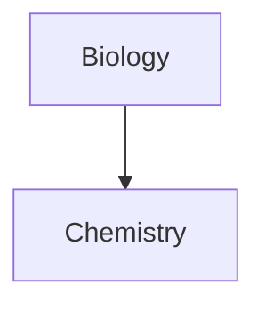

[Linking files in a diagram](https://help.obsidian.md/Editing+and+formatting/Advanced+formatting+syntax#Linking+files+in+a+diagram)

``` 
graph TD 

Biology --> Chemistry 

class Biology,Chemistry internal-link; 
```



