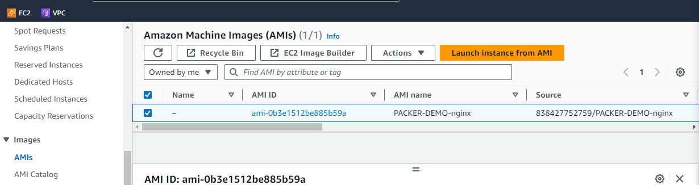

> [!info]
> This project uses **Vagrant** as a test environment to run **Packer** within a virtual machine. The primary goal is to produce custom Amazon Machine Images (**AMI**s) for **AWS**. 

## Vagrant Environment: 
This **Vagrant** configuration is aimed at setting up an environment with **AWS CLI** and HashiCorp's **Packer**. The virtual environment will run on an "ubuntu/bionic64" base box and facilitate the **AWS CLI**'s configuration based on the user's input for access and secret keys. Once the **AWS CLI** is configured, it runs a test to list objects in S3, ensuring the setup is successful. Additionally, the script installs **Packer**, a tool used to create machine and container images for multiple platforms.

```bash
puts "Please enter your YOUR_ACCESS_KEY:"
YOUR_ACCESS_KEY = STDIN.gets.chomp
puts "Please enter your YOUR_SECRET_KEY:"
YOUR_SECRET_KEY = STDIN.gets.chomp
YOUR_DEFAULT_REGION = "us-east-1" 
YOUR_PREFERRED_OUTPUT_FORMAT = "json"

Vagrant.configure("2") do |config|
  config.vm.box = "ubuntu/bionic64"
  
  # Shared folder configuration
  config.vm.synced_folder "./shared", "/home/vagrant/shared"

  # AWS CLI Node Configuration
  config.vm.define "aws_cli" do |node1|
    node1.vm.hostname = "AWSCLI"
    node1.vm.network "private_network", type: "dhcp"
    
    # Install AWS CLI
    node1.vm.provision "shell", inline: <<-SHELL 
      apt-get update
      apt-get install unzip
      curl "https://awscli.amazonaws.com/awscli-exe-linux-x86_64.zip" -o "awscliv2.zip"
      unzip awscliv2.zip
      sudo ./aws/install
      aws --version
    SHELL
    
    # Configure AWS CLI
    node1.vm.provision "shell", privileged: false, inline: <<-SHELL
      aws configure set aws_access_key_id "#{YOUR_ACCESS_KEY}"
      aws configure set aws_secret_access_key "#{YOUR_SECRET_KEY}"
      aws configure set default.region "#{YOUR_DEFAULT_REGION}"
      aws configure set default.output "#{YOUR_PREFERRED_OUTPUT_FORMAT}"
      aws configure list
      aws s3 ls
    SHELL

    # Install Packer
    node1.vm.provision "shell", inline: <<-SHELL 
      curl -fsSL https://apt.releases.hashicorp.com/gpg | sudo apt-key add -
      sudo apt-add-repository "deb [arch=amd64] https://apt.releases.hashicorp.com $(lsb_release -cs) main"
      sudo apt-get update && sudo apt-get install packer
      packer --version
    SHELL
  end
end
```


## Packer Template:
This **Packer template** is geared towards automating the creation of custom Amazon Machine Images (**AMI**s) for **AWS**. It fetches the most recent RHEL-8 **AMI** and provisions it with custom configurations, eventually wrapping it up into a Vagrant box as well.

```bash
data "amazon-ami" "latest_base_image" {
  filters = {
    virtualization-type = "hvm"
    name                = "RHEL-8*_HVM-*"
    root-device-type    = "ebs"
    architecture        = "x86_64"
  }
  owners      = ["309956199498"] # Red Hat account ID
  most_recent = true
}

variable "app_name" {
  type    = string
  default = "nginx"
}

locals {
  ami_id = data.amazon-ami.latest_base_image.id
}

source "amazon-ebs" "nginx" {
  ami_name      = "PACKER-DEMO-${var.app_name}"
  instance_type = "t2.micro"
  region        = "us-east-1"
  source_ami    = "${local.ami_id}"
  ssh_username  = "ec2-user"
  tags = {
    Env  = "DEMO"
    Name = "PACKER-DEMO-${var.app_name}"
  }
}

build {
  sources = ["source.amazon-ebs.nginx"]

  provisioner "shell" {
    script = "script/script.sh"
  }

  post-processor "vagrant" {
    only = ["amazon-ebs.nginx"]
  }
}
```


**Key Components:**  
**Data Source:** Fetches the most recent version of RHEL-8 **AMI**.  
**Locals:** Defines commonly used variables, notably the name of the application (nginx) and the fetched **AMI ID**.  
**Source Block:** Configures the **AMI** creation process with settings like instance type, region, and SSH access details.  
**Build Block:** Specifies how the image should be provisioned, and processed. Here, a shell script (*script.sh*) is used for provisioning, and a **Vagrant** post-processor is added to the workflow.  

**script.sh** contains:
```bash
#!/bin/bash
sudo yum -y update
sudo yum install -y nginx
sudo chkconfig nginx on
```


I have all these files in a directory named shared. This directory is set up to synchronize with the **Vagrant** virtual machine (VM). Specifically, the contents of the shared directory on the host are mirrored within the `/home/vagrant/shared` directory inside the VM.  

The **Vagrant**file contains the configuration that establishes this synchronization:
``` bash
  config.vm.synced_folder "./shared", "/home/vagrant/shared"
```

When we inspect the contents of the shared directory from within the VM:
```bash
vagrant@AWSCLI:~/shared$ tree
.
├── script
│   └── script.sh
└── vm.pkr.hcl

1 directory, 2 files
```
*This exists in the same directory as the **Vagrantfile***

It reveals:  
A sub-directory named script which contains a shell script `script.sh`.  
A **Packer template** file `vm.pkr.hcl`.

This structure means that any changes made to the files within the shared directory on the host machine will be immediately reflected inside the VM at `/home/vagrant/shared`. This synchronization makes it easier to work with and edit files, as changes can be made on the host and then instantly tested or deployed within the VM.  


To validate the Packer configuration, run:
```bash
packer validate vm.pkr.hcl
```

Output:
> The configuration is valid.


To execute the build based on the configuration:
```bash
packer build vm.pkr.hcl
```

After a successful build, the **AMI** is created in **AWS**:  




---

> [!quote] Credits
> This project was inspired by the article ["Packer Tutorial For Beginners – Automate AMI Creation"](https://devopscube.com/packer-tutorial-for-beginners/) written by Bibin Wilson on January 5, 2023.
> 

---
