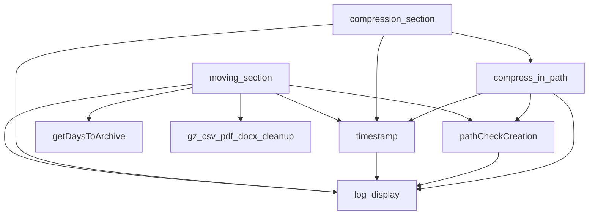
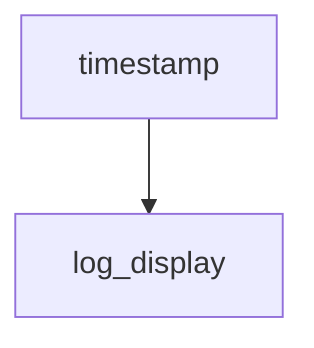
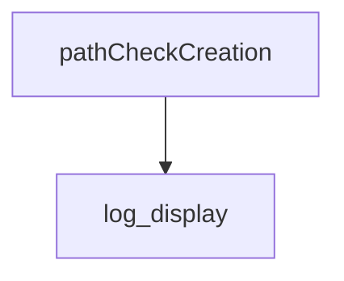
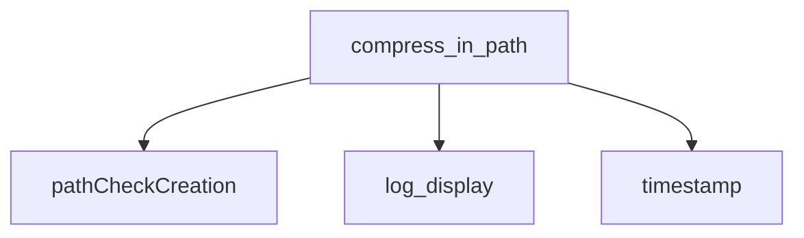
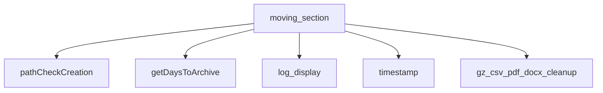
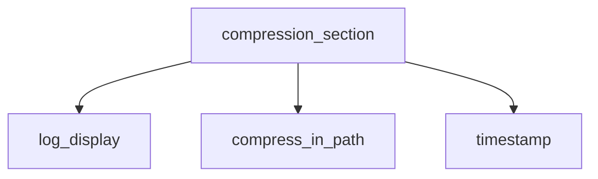

#bash

Replaced by [[XSOAR Archive Script README]]

#### Paths & Vars

```bash
temp="/home/MSS/hectrodr/Desktop
```
The `$temp` variable as the name implies, it's temporary. Used in my sandbox environment. Comment this out to run XSOAR server 

```bash
basePath="$temp/var/lib"
BAKpath="$temp/backups"
```
- The `$basePath` is a point of reference from which all other paths start `/var/lib`. It includes `$temp` for testing purposes. If the initialization of `$temp` above is commented-out the value here should be **null**
- `$BAKpath` has the patch to a backup location
```bash
demistoPath="$basePath/demisto"
tenantsPath="$demistoPath/tenants"
archivePathDem="$BAKpath/demisto-archive"
```
Here, we are trying to build multiple paths by concatenating variables to strings
- `$demistoPath` is path `/var/lib/demisto` which contains demisto's `/Data` folder *(it has what we need to archive and its path structure differs from the Tenants)*
- `$tenantsPath` is path `/var/lib/demisto/tenants` which contains all the Tenants
- `$archievePathDem` is path `/backups/demisto-archive` this is the destination of the archives for **demisto** *(the **Tenants** have their own `demisto-archive` folder each)*

```bash
fileAge=$1
```
`$fileAge` holds the age of a file in days. The value can be passed to the script as an argument. If a value is not passed as an argument we use the **below** if statement to give it a a **default** value of **365** days
```bash
if [ -z "$file Age" ]
then  
      fileAge="365" #If fileAge is empty do this
      echo "Using DEFAULT File age $fileAge days" 
else
      echo "Using USER GIVEN File age $fileAge days"
fi
```
*(If statement to set a default value of 365 days)*


```bash
counter=0 
```
The variable `$counter` is used to count processed files *(compressed)*. It is used by the function `compress_in_path()` shown below

```bash
tenantsList=$(ls $tenantsPath)
```
`$tenantList` holds the list of **Tenants**. The list is generated by running the `ls` command in path `/var/lib/demisto/tenants` 


---


#### Functions



*(above relationship between functions)*

--- 
##### log_display
```bash
function log_display (){ #accepts two arguments a message and number to indicate color 0 Green 1 Red
  Blue='\033[0;34m'
  Yellow='\033[0;33m'
  NC='\033[0m' # No Color
  Cyan='\e[96m'
  Gree='\e[92m'
  Red='\e[91m'
  local temp
  
  if [ "$2" == "0" ]; then
    printf "${Gree} \e[1m[OK] $1${NC}\n" #Using \e[1ml for Bold 
    printf "[OK] $1\n" >> $logPath
  elif [ "$2" == "1" ]; then
    printf "${Red} \e[1m[ERROR] $1${NC}\n"
    printf "[ERROR] $1\n" >> $logPath
  else
    printf "${Yellow} \e[1m[INFO] ${NC} ${Cyan}$1${NC}\n"
    printf "[INFO] $1\n" >> $logPath
  fi
}
```
This function's purpose is to output messages to console and log them to a file. It has an if statement for different keywords and colors. 

##### function gz_csv_pdf_docx_cleanup
```bash
function gz_csv_pdf_docx_cleanup(){
  #Deletes .gz, csv files and pdfs older than 7 days, accepts a path
  local path=$1
  log_display "Cleaning path $1" "0"

  #remove both gz and csv, when there is nothing to remove it shows rm: missing operand
  rm $(find $path -type f -name "*.csv" -o -name "*.gz")
  #pdfs older than 1 weel
  rm $(find $path -type f -name "*.pdf" -o -name "*.docx" -mtime +7)
}
```

The function `gz_csv_pdf_docx_cleanup` is a function that deletes files with the `.gz`, `.csv`, `.pdf`, and `.docx` *(`.pdf`, and `.docx` that are older than 7 days)*. It accepts a path as its only argument and uses the `find` command to search for the specified file types in the specified path. It then uses the `rm` command to delete the files that match the search criteria. The function also logs the path that it is cleaning and displays a message indicating that.

##### timestamp



```bash
function timestamp(){
  #Accepts 4 arguments start and end to calculate diff output time taken in seconds and minutes
  #third argument is a message you want to display in conjunction with the time
  #4th argument is a switch to not record things in timesRecord variable
  local STARTTIME=$1
  local ENDTIME=$2
  local message=$3
  
  let DURATION_S=${ENDTIME}-${STARTTIME}
  let DURATION_M=$(( $DURATION_S / 60 )) #turn into minutes  
  print="$message $DURATION_S seconds($DURATION_M minutes)"
  log_display "$print" "0"

  #To prevent recording in $timesRecord using argument 0
  if [ "$4" != "0" ]
  then
    timesRecord+="$print'\n'" #To record all time-stamp times for output
  fi
}
```

The `timestamp()` function calculates time differences in seconds and minutes for output. It needs 2 arguments `STARTTIME` and `ENDTIME`. It accepts a third argument **message** to give the time-calculated a description.

In addition,  we create a variable `$timesRecord` which accumulates all the outputs to `echo` at a later time. If there is message NOT to be included in this variable pass a 4th argument `0` 

This function is called 4 times, once by each of the following functions `moving_section` , `compression_section`, `compress_in_path` and once in the body of the script   

In `compress_in_path` function we utilize the 4th argument `0` to prevent the recording of individual folder compression time
```bash
timestamp $STARTTIME $ENDTIME "Individual compresion & move of <$dayFolder> took " "0"
```


##### pathCheckCreation



```bash
function pathCheckCreation(){
  #Create folder if it doesn't exist
  if [ ! -d $1 ]; then
      echo "pathCheckCreation is creating $1"
      mkdir -p $1;
  fi;
}
```

This function simply accepts a path and if it does not exist it creates

##### getDaysToArchive

```bash
function getDaysToArchive(){
  local path=$1
  local fileAge=$2
  #Finds only folder with pattern "_" followed by "6 numbers" ex: _062021
  #Prevents getting modified date of irrelevant folders, those that dont have month and year
  local listFiles=$(find $path -type d -name "*_[0-9][0-9][0-9][0-9][0-9][0-9]*" -mtime +$fileAge) 

    for file in $listFiles
    do
      var=${file: -6} #cut the last 6 characters from file path, (ex: 092020)
      listofdays+="$var " #concatenating each day (in each newline) into a list/var
    done

  echo "$listofdays" | tr ' ' '\n' | sort -nu #Getting unique values
}
```

This function generates a list of days with format `mmYYY`. It accepts a path and finds the modified date of files/folders in that path and calculates whether they are older than the amount of days given by `$fileAge`.

The files that match *(those older than `$fileAge`)* are stored in `$listFiles`.  At this point `$listFiles` has a list of folders. We loop through each of them and extract the month/year from their name `var=${file: -6}` and  store results in `$listofdays`. 

```bash
daysToArchive=$(getDaysToArchive "$tenantData" "$fileAge")
```
*(example of this function being called by `moving_section`)*


##### compress_in_path



```bash
function compress_in_path(){ 
  #Compresses all folders in the path given. Path should be demisto-archive and folders to be compressed are in the format ex: 092020
  local dayFoldersPath=$1
  
  #Listing all folder in give path (ex: 092020) excluding those ending .tar.gz or that start with archived-
  #This avoids re-zipping and zipping folder archived-<YYYY> 
  dayFolders=$(ls --ignore="*.tar.gz" --ignore="archived-*" "$dayFoldersPath")

  #Looping through all folders in the list to compress
  for dayFolder in $dayFolders
  do
    local STARTTIME=`date +%s`
    achivedYYYY="$dayFoldersPath/archived-${dayFolder:2:5}" #Extracting the year from $dayToArchive to form a path/folder (ex: archived-2020)
    pathCheckCreation "$achivedYYYY" #Creating the newly formed path above

    log_display "Compressing <$dayFolder> in <$dayFoldersPath>"
    relativePath="$dayFoldersPath"
    cd $relativePath
                                                                 
    tar -czf "$dayFolder.tar.gz" ./$dayFolder
    if [ $? -eq 0 ]; then
      log_display "$dayFolder dir compressed\n" "0"
      let counter++
      rm -r ./$dayFolder #removing folder if succesfull compression
      if [ $? -eq 0 ]; then
        log_display "$dayFolder dir deleted\n" "0"
      else
        log_display "$dayFolder dir NOT deleted\n" "1"
      fi
    else
      log_display "Failed to compressed dir $dayFolder" "1"
    fi    
    #Moving all zipped folders to their corresponding (by year) archived-<YYYY> folder (ex: archived-2020)
    mv "$dayFoldersPath/$dayFolder.tar.gz" "$achivedYYYY"
    if [ $? -eq 0 ]; then
      log_display "MOVED $dayFoldersPath/$dayFolder.tar.gz to\n  $achivedYYYY" "0"
    else
      log_display "Failed to move $dayFoldersPath/$dayFolder.tar.gz to\n $achivedYYYY" "1"
    fi
    
    local ENDTIME=`date +%s` 
    timestamp $STARTTIME $ENDTIME "Individual compresion & move of <$dayFolder> took " "0"
  done                                                                               
}
```

This function compresses folders in a given path. In this case we pass `/demisto-archive`
	path which should contain folders named with month and year (ex: 092020). We get a list of these folders and store it in `$dayFolders`. We then loop through this variable to run the command `tar -czf` on each individual folder to compress it and `mv` to move them to their final destination `$achivedYYYY` *(**ex**: `demisto-archive/archived-2021`)*

#####  moving_section




The main task of this function is to move files from source `/Data` to `demisto-archive` *(task that requires service to be down)*

We have 2  blocks of code here, one for **Tenants** and one for **Demisto**

**Tenants**
```bash
#FOR TENANTS
for tenant in $tenantsList
do
  tenantData="$tenantsPath/$tenant/data"
  tenantDemArch="$BAKpath/$tenant/demisto-archive"

  pathCheckCreation "$tenantDemArch" #Creates /demisto-archive inside each tenant

  #Calling function getDaysToArchive to get list of unique days to archive
  daysToArchive=$(getDaysToArchive "$tenantData" "$fileAge")

  log_display "Working on Tenant: <$tenant>\n From its Data path: <$tenantData>\n We get the following list of mmYYYY to archive:\n $daysToArchive\n"
  
  #Looping through list of unique days mentioned above
  for dayToArchive in $daysToArchive
  do
  ...
  ...
  done
done
```
We encounter our first **Loop** *(with nested/inner loop)* which iterates through each **Tenant**. The loop starts with creating 2 variables
  - `$tenantData` has path  `/var/lib/demisto/tenants/<tenant>/data` *(`<tenant> `changes as we loop)*
  - `$tenantDemArch` has path `/backups/tenants/<tenant>/demisto-archive` *(`<tenant> `changes as we loop)*. We create this path by calling function `pathCheckCreation` and giving this variable as argument
  - `$daysToArchive` has a list of days *(format `mmYYYY`)* targeted for archiving. The list is generated by calling function `getDaysToArchive` and passing the path of the `/Data` folder and the desired age of the file `$fileAge`
  - We call `log_display` function to output to console and log
  - Next we have the inner loop

With use the inner loop to iterate through the list of days *(`mmYYYY`)* 
```bash
    for dayToArchive in $daysToArchive
    do
      dest="$tenantDemArch/$dayToArchive"
      pathCheckCreation "$dest"
      mv $tenantData/**/*_$dayToArchive* $dest #Moving data that matches pattern ex: *_092020*
    done
```

We start by creating `$dest` with a path that changes as it loops. It will hold `/backups/tenants/<tenant>/demisto-archive/<day_to_ _archive>`  
***ex**: `/backups/tenants/acc_DECODE/demisto-archive/092020`*  
We pass `$dest` to function `pathCheckCreation` to create the path. Once created we can start moving files/folders to it using the `mv` command with a combination of wild cards that looks something like this example:  
`mv /var/lib/demisto/tenants/acc_DECODE/data/**/*_092020* $dest`  

The example above will look for anything that matches pattern `*_092020*` starting in folder `/Data` where we are indicating to look recursively with *(/\*\*/)*. In our case this means we will search inside 2 folders located inside `/Data` *(`demistoidx` which contains additional folders and `partitionsData` that contains files with `.db` extension)*

This `mv` command in conjunction with this pattern will capture Folders and Files that match and moves them to their new location `$dest`

**Demisto**
```bash
#FOR DEMISTO, 
pathCheckCreation "$archivePathDem" #Creating path
#Calling function getDaysToArchiveg to get list of unique days to archive
daysToArchiveDem=$(getDaysToArchive "$demistoPath/data" "$fileAge")

log_display "\nWorking on Demisto's data path: $demistoPath/data\n We get the following list of mmYYYY to archive\n $daysToArchiveDem\n"

#Looping through list of unique d\ays mentioned above
for dayToArchive in $daysToArchiveDem
do
  dest="$archivePathDem/$dayToArchive" #Forming path to send to pathCheckCreation for creation
  pathCheckCreation "$dest" #Creating path
  #cp -r $demistoPath/data/**/*_$dayToArchive* $dest #Using cp instead of mv, testing purposes
  mv $demistoPath/data/**/*_$dayToArchive* $dest #Moving data that matches pattern ex: *_092020*
done
```

Unlike with **Tenants** we don't have to loop thought different clients. It does contain a loop for the "Days to Archive" list *(same as the inner loop in **Tenants** section)*

We start by creating demisto's `demisto-archive` folder by calling function `pathCheckCreation`

Just like the **Tenants** section has a variable `$daysToArchive` we have one here `$daysToArchiveDem` generated the same way and for the same purpose. Only difference is we are using demisto's own `/Data` and not the **Tenants**.

We call `log_display` to display and log information

Then we loop doing the same as in the **Tenants** inner loop but using different paths

#####  compression_section




The main tasks *(tasks that can be done with **service up**)* of this section is to compress folders and move them to their corresponding `archived-` folder (*ex:* `archived-2020`)

###### Tenants
```bash
#COMPRESSING FOR TENANTS
for tenant in $tenantsList 
do
  tenantDemArch="$BAKpath/$tenant/demisto-archive"
  
  log_display "Working on Tenant: <$tenant> compression\n In path <$tenantDemArch>\n We will compress the following folders\n $(ls --ignore='*.tar.gz' --ignore='archived-*' $tenantDemArch)\n"
  
  compress_in_path "$tenantDemArch" #Compressing each folder (ex: 092020) found in this path
done
```
Just like in the **Tenants** section of function `moving_section` we use the same loop to iterate through clients

We call the function `compress_in_path` passing it the path of that Tenant's ``
`demisto-archive` folder *(path in `$tenantDemArch`)*. The function will compress each folder found here *(ex: 092020)*


###### Demisto
```bash
#COMPRESSING FOR DEMISTO
log_display "Working on Demisto's path <$archivePathDem>\n We will compress the following folders\n $daysToArchiveDem\n"

compress_in_path "$archivePathDem" #Compress each folder inside /backups/demisto-archive
```
Demisto's compression is the same as the **Tenants** without looping. We use a different variable because path is different  
`$archievePathDem` is path `/backups/demisto-archive`  
We call `compress_in_path` which zips all folders in that location

#### Main Body
This includes things we already discussed such as **variables** and the **if statement** that populates `$fileAge`  

```bash
#STOP SERVICE 
service demisto stop 

tenantsList=$(ls $tenantsPath) #Getting list of tenants by doing (ls) inside /var/lib/demisto/tenants
log_display "List of Tenants: \n$tenantsList"

moving_section "${tenantsList[@]}"

#START SERVICE
service demisto start

compression_section "${tenantsList[@]}"


#Whole Script Time-stamp
ENDTIME=`date +%s`
#Calling time-stamp function to calculate times
timestamp $STARTTIME $ENDTIME "The whole script took "

log_display "Items Processed: $counter"
log_display "$timesRecord" #Output of all times calculated by function time-stamp

#Making sure the service is up
echo "Checking Service Status"
service demisto status | grep "Active: 
```

In addition, it includes the following things  
-  **Stopping** service `service demisto stop`
- Getting list of tenants
- Passing `$tenantsList` to function `moving_section`
- **Starting** service `service demisto start`
- Passing `$tenantsList` to function `compression_section` 
- Then we the `timestamp` and `log_display` functions


Example
Running the script manually looks something like this. 


